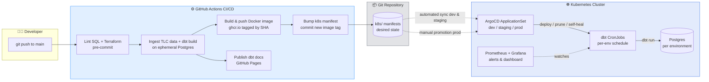

# 🚕 GreenTaxi GitOps Pipeline

[](https://github.com/yvan-ai/GreenTaxi-GitOps-Pipeline/actions/workflows/ci.yml)
[](LICENSE)
[](https://www.getdbt.com/)
[](https://www.terraform.io/)
[](https://argo-cd.readthedocs.io/)
[](https://kubernetes.io/)

> **A fully automated, zero-touch data transformation platform.** Push SQL to `main`, and GitOps takes it from validated dbt model → containerized image → running Kubernetes CronJob — with **0 manual deployment steps**.

This project demonstrates an end-to-end **Data Engineering + Platform Engineering** workflow: infrastructure as code, containerized dbt transformations, continuous integration, and declarative GitOps delivery via ArgoCD.

---

## 🏗️ Architecture



**The core loop:** the Git repository is the single source of truth. CI validates and builds; ArgoCD continuously reconciles the cluster to match Git. Infrastructure drift is impossible — ArgoCD prunes and self-heals any manual change.

---

## 🧰 Tech Stack

| Layer | Technology | Role |
|-------|-----------|------|
| **Infrastructure** | Terraform + Helm | Provisions ArgoCD + monitoring on Kubernetes, provider-agnostic (Kind today, EKS/GKE tomorrow) |
| **Orchestration** | Kubernetes (Kind) | Runs the per-env dbt CronJobs and the ArgoCD control plane |
| **Ingestion** | Python (pandas + pyarrow) | Loads official NYC TLC Parquet exports into Postgres, idempotent per month |
| **Data transformation** | dbt + PostgreSQL | Source freshness checks, staging views, incremental marts |
| **CI/CD** | GitHub Actions | Lints, ingests, tests, builds & tags images, publishes docs, updates manifests |
| **GitOps** | ArgoCD ApplicationSets | dev/staging auto-sync, prod manual promotion, prune + self-heal |
| **Observability** | Prometheus + Grafana | Alerts on failed/missing dbt runs, pipeline dashboard |
| **Packaging** | Docker (GHCR) | Immutable dbt runtime images tagged by commit SHA |
| **Code quality** | pre-commit, SQLFluff, tflint | Enforces SQL & Terraform standards before commit |

---

## ✨ Key Features

- **Zero-touch deployment** — a push to `main` deploys to dev & staging with no manual step; prod is a one-click reviewed promotion.
- **Real data, real freshness** — official NYC TLC Parquet data with dbt source freshness gates (warn 25h / error 49h).
- **Incremental transformations** — only months receiving new data are recomputed (`delete+insert`).
- **Immutable, traceable images** — every image is tagged with its Git commit SHA.
- **Self-healing infrastructure** — ArgoCD reverts any drift from the Git-declared state.
- **Quality gates before build** — dbt models are parsed and tested against an ephemeral Postgres in CI before any image is built.
- **Monitored by default** — Prometheus alerts on failed *and missing* runs; Grafana dashboard shipped via GitOps.
- **Living documentation** — dbt docs & lineage published to GitHub Pages on every merge.
- **Provider-agnostic IaC** — the same Terraform runs on local Kind or a managed cloud cluster.

---

## 🚀 Quick Start (< 5 min)

**Prerequisites:** [Docker](https://docs.docker.com/get-docker/), [Kind](https://kind.sigs.k8s.io/), [kubectl](https://kubernetes.io/docs/tasks/tools/), [Terraform](https://developer.hashicorp.com/terraform/downloads) ≥ 1.8, and [Python](https://www.python.org/) 3.11.

```bash
# 1. Clone
git clone https://github.com/yvan-ai/GreenTaxi-GitOps-Pipeline.git
cd GreenTaxi-GitOps-Pipeline

# 2. Create a local cluster
kind create cluster --name greentaxi

# 3. Provision ArgoCD + monitoring stack via Terraform
make infra-up

# 4. Register the environments (ApplicationSet: dev / staging / prod)
kubectl apply -f k8s/appset.yaml -f k8s/monitoring-app.yaml

# 5. Load real NYC TLC data and run the dbt models locally
make ingest
make run
```

Run `make help` to see all available targets.

> **Troubleshooting**
> - A local Postgres already on port 5432? Export `DB_PORT` before `make ingest` / `make run`
>   and point it at your own instance.
> - kind fails at `kubeadm init` on a cgroup v1 host (older WSL2/Docker Desktop):
>   create the cluster with `--image kindest/node:v1.31.9`.

---

## 📂 Project Structure

```
GreenTaxi-GitOps-Pipeline/
├── .github/workflows/       # CI/CD (lint → ingest → test → build → docs → GitOps bump)
├── ingestion/               # NYC TLC Parquet → Postgres loader (idempotent per month)
├── GreenTaxi/               # dbt project
│   ├── models/
│   │   ├── staging/         # sources.yml (freshness) + stg_green_tripdata
│   │   └── marts/           # fct_monthly_revenue — incremental analytics mart
│   ├── schema.yml           # model docs + data tests
│   ├── dbt_project.yml
│   ├── profiles.yml         # env-var driven connection (no hardcoded secrets)
│   └── Dockerfile           # dbt runtime image
├── terraform/               # IaC: ArgoCD + kube-prometheus-stack via Helm
├── k8s/                     # Declarative manifests reconciled by ArgoCD
│   ├── appset.yaml          # ApplicationSet: dev / staging / prod
│   ├── monitoring-app.yaml  # Application for the monitoring resources
│   ├── base/                # Kustomize base: Postgres + dbt CronJob
│   ├── envs/                # Overlays: namespace + schedule per environment
│   └── monitoring/          # PrometheusRule alerts + Grafana dashboard
├── docs/
│   ├── architecture.md      # Detailed architecture & data flow
│   └── decisions/           # Architecture Decision Records (ADRs)
├── Makefile                 # Standardized entry points
├── .pre-commit-config.yaml  # SQLFluff + Terraform hooks
├── PRD.md / TECH_SPEC.md    # Product & technical specifications
└── LICENSE
```

---

## 🧠 Technical Decisions

Key design choices are documented as Architecture Decision Records:

- [ADR 0001 — ArgoCD for GitOps delivery](docs/decisions/0001-use-argocd-for-gitops.md)
- [ADR 0002 — dbt + PostgreSQL for the transformation layer](docs/decisions/0002-use-dbt-with-postgres.md)
- [ADR 0003 — Multi-environment promotion with ApplicationSets](docs/decisions/0003-multi-env-with-applicationsets.md)
- [ADR 0004 — Secrets provisioned by Terraform, never stored in Git](docs/decisions/0004-secrets-outside-git.md)

📖 **[Browse the dbt docs & lineage graph](https://yvan-ai.github.io/GreenTaxi-GitOps-Pipeline/)** (auto-published by CI)

See [docs/architecture.md](docs/architecture.md) for the full data flow, quality strategy, and idempotency design.

---

## 📊 Results & Metrics

| Metric | Value |
|--------|-------|
| Manual deployment steps after a push (dev/staging) | **0** |
| Real trips processed per ingested month | **~76,000** (2021-01) |
| dbt models validated before image build | **100%** |
| Source staleness tolerated before CI fails | 49h |
| Environments from one ApplicationSet | 3 (dev / staging / prod) |
| Image traceability | 1:1 image ↔ commit SHA |
| Infrastructure drift tolerance | 0 (ArgoCD prune + self-heal) |
| Deploy target portability | Kind → EKS/GKE without code change |

---

## 🗺️ Roadmap

- [x] Ingest real NYC TLC trip data (Parquet) instead of the mocked source row
- [x] Add dbt `sources` with freshness checks and incremental models
- [x] Publish dbt docs & lineage to GitHub Pages
- [x] Add Prometheus/Grafana monitoring for the CronJob
- [x] Multi-environment promotion (dev → staging → prod) via ArgoCD ApplicationSets

- [x] No secrets in Git — Terraform-generated credentials per environment ([ADR 0004](docs/decisions/0004-secrets-outside-git.md))

**Next up:**

- [ ] External Secrets Operator backed by a managed vault (cloud deployment)
- [ ] Slack notifications on ArgoCD sync failures and Prometheus alerts
- [ ] Data quality expansion: `unique`, `accepted_values` and relationship tests

---

## 📫 Contact

**Yvan Kenne**
- LinkedIn: [linkedin.com/in/yvankenne](https://www.linkedin.com/in/yvankenne/)
- Email: [kenneyvan65@gmail.com](mailto:kenneyvan65@gmail.com)

---

<p align="center"><i>Built to demonstrate production-grade Data & Platform Engineering practices.</i></p>
