# 🚕 GreenTaxi GitOps Pipeline

[](https://github.com/yvan-ai/GreenTaxi-GitOps-Pipeline/actions/workflows/ci.yml)
[](LICENSE)
[](https://www.getdbt.com/)
[](https://www.terraform.io/)
[](https://argo-cd.readthedocs.io/)
[](https://kubernetes.io/)

> **A fully automated, zero-touch data transformation platform.** Push SQL to `main`, and GitOps takes it from validated dbt model → containerized image → running Kubernetes CronJob — with **0 manual deployment steps**.

This project demonstrates an end-to-end **Data Engineering + Platform Engineering** workflow: infrastructure as code, containerized dbt transformations, continuous integration, and declarative GitOps delivery via ArgoCD.

---

## 🏗️ Architecture

```mermaid
flowchart LR
    subgraph DEV["👩‍💻 Developer"]
        A[git push to main]
    end

    subgraph GHA["⚙️ GitHub Actions CI/CD"]
        B[Lint SQL + Terraform<br/>pre-commit]
        C[dbt parse & test<br/>on ephemeral Postgres]
        D[Build & push Docker image<br/>ghcr.io tagged by SHA]
        E[Bump k8s manifest<br/>commit new image tag]
    end

    subgraph GIT["📦 Git Repository"]
        F[(k8s/ manifests<br/>desired state)]
    end

    subgraph K8S["☸️ Kubernetes Cluster"]
        G[ArgoCD<br/>watches /k8s]
        H[dbt CronJob<br/>nightly run]
        I[(Postgres<br/>data warehouse)]
    end

    A --> B --> C --> D --> E --> F
    F -.automated sync.-> G
    G -->|deploy / prune / self-heal| H
    H -->|dbt run| I

    style GHA fill:#2088FF22,stroke:#2088FF
    style K8S fill:#326CE522,stroke:#326CE5
    style GIT fill:#6e768133,stroke:#6e7681
```



**The core loop:** the Git repository is the single source of truth. CI validates and builds; ArgoCD continuously reconciles the cluster to match Git. Infrastructure drift is impossible — ArgoCD prunes and self-heals any manual change.

---

## 🧰 Tech Stack

| Layer | Technology | Role |
|-------|-----------|------|
| **Infrastructure** | Terraform + Helm | Provisions ArgoCD on Kubernetes, provider-agnostic (Kind today, EKS/GKE tomorrow) |
| **Orchestration** | Kubernetes (Kind) | Runs the dbt CronJob and the ArgoCD control plane |
| **Data transformation** | dbt + PostgreSQL | Models NYC Green Taxi trip data into analytics-ready marts |
| **CI/CD** | GitHub Actions | Lints, tests, builds & tags images, updates manifests |
| **GitOps** | ArgoCD | Declarative, automated sync with prune + self-heal |
| **Packaging** | Docker (GHCR) | Immutable dbt runtime images tagged by commit SHA |
| **Code quality** | pre-commit, SQLFluff, tflint | Enforces SQL & Terraform standards before commit |

---

## ✨ Key Features

- **Zero-touch deployment** — a push to `main` deploys to the cluster with no manual step.
- **Immutable, traceable images** — every image is tagged with its Git commit SHA.
- **Self-healing infrastructure** — ArgoCD reverts any drift from the Git-declared state.
- **Quality gates before build** — dbt models are parsed and tested against an ephemeral Postgres in CI before any image is built.
- **Provider-agnostic IaC** — the same Terraform runs on local Kind or a managed cloud cluster.

---

## 🚀 Quick Start (< 5 min)

**Prerequisites:** [Docker](https://docs.docker.com/get-docker/), [Kind](https://kind.sigs.k8s.io/), [kubectl](https://kubernetes.io/docs/tasks/tools/), [Terraform](https://developer.hashicorp.com/terraform/downloads) ≥ 1.8, and [Python](https://www.python.org/) 3.11.

```bash
# 1. Clone
git clone https://github.com/yvan-ai/GreenTaxi-GitOps-Pipeline.git
cd GreenTaxi-GitOps-Pipeline

# 2. Create a local cluster
kind create cluster

# 3. Provision ArgoCD via Terraform
make infra-up

# 4. Register the application (ArgoCD starts syncing /k8s)
kubectl apply -f k8s/argocd-app.yaml

# 5. Run the dbt models locally against Postgres
make run
```

Run `make help` to see all available targets.

---

## 📂 Project Structure

```
GreenTaxi-GitOps-Pipeline/
├── .github/workflows/       # CI/CD pipeline (lint → test → build → GitOps bump)
├── GreenTaxi/               # dbt project
│   ├── models/
│   │   ├── staging/         # stg_green_tripdata — cleaned source layer
│   │   └── marts/           # fct_monthly_revenue — analytics mart
│   ├── schema.yml           # model docs + data tests
│   ├── dbt_project.yml
│   ├── profiles.yml         # env-var driven connection (no hardcoded secrets)
│   └── Dockerfile           # dbt runtime image
├── terraform/               # IaC: ArgoCD install via Helm (provider-agnostic)
├── k8s/                     # Declarative manifests reconciled by ArgoCD
│   ├── argocd-app.yaml      # ArgoCD Application (automated sync + prune)
│   └── dbt-cronjob.yaml     # Nightly dbt run
├── docs/
│   ├── architecture.md      # Detailed architecture & data flow
│   └── decisions/           # Architecture Decision Records (ADRs)
├── Makefile                 # Standardized entry points
├── .pre-commit-config.yaml  # SQLFluff + Terraform hooks
├── PRD.md / TECH_SPEC.md    # Product & technical specifications
└── LICENSE
```

---

## 🧠 Technical Decisions

Key design choices are documented as Architecture Decision Records:

- [ADR 0001 — ArgoCD for GitOps delivery](docs/decisions/0001-use-argocd-for-gitops.md)
- [ADR 0002 — dbt + PostgreSQL for the transformation layer](docs/decisions/0002-use-dbt-with-postgres.md)

See [docs/architecture.md](docs/architecture.md) for the full data flow, quality strategy, and idempotency design.

---

## 📊 Results & Metrics

| Metric | Value |
|--------|-------|
| Manual deployment steps after a push | **0** |
| dbt models validated before image build | **100%** |
| Image traceability | 1:1 image ↔ commit SHA |
| Infrastructure drift tolerance | 0 (ArgoCD prune + self-heal) |
| Deploy target portability | Kind → EKS/GKE without code change |

---

## 🗺️ Roadmap

- [ ] Ingest real NYC TLC trip data (Parquet) instead of the mocked source row
- [ ] Add dbt `sources` with freshness checks and incremental models
- [ ] Publish dbt docs & lineage to GitHub Pages
- [ ] Add Prometheus/Grafana monitoring for the CronJob
- [ ] Multi-environment promotion (dev → staging → prod) via ArgoCD ApplicationSets

---

## 📫 Contact

**Yvan Kenne**
- LinkedIn: [linkedin.com/in/yvankenne](https://www.linkedin.com/in/yvankenne/)
- Email: [kenneyvan65@gmail.com](mailto:kenneyvan65@gmail.com)

---

<p align="center"><i>Built to demonstrate production-grade Data & Platform Engineering practices.</i></p>
